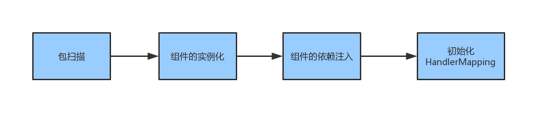
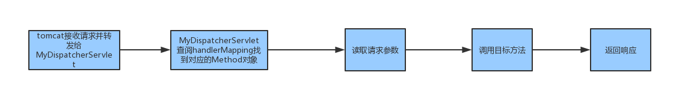
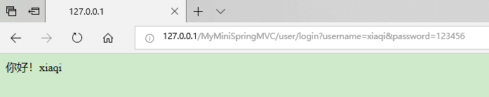

##### a mini springMVC implementation
###### the process of development
1. finishing the scanning basic package for components
2. finishing the instantiation of components
3. finishing the dependency injection
4. finishing the initialization of handler mapping
---
##### 一个mini版的springMVC实现
###### 开发流程
1. 完成basic package的扫描
2. 完成组件的实例化
3. 完成组件间的依赖注入
4. 完成处理器映射的初始化
---
启动流程图：



处理请求流程图：


---
##### 效果展示
1. example code:
```
@MyController
@MyRequestMapping("/user")
public class UserController {
	
	@MyAutowired
	private UserService service;

	@MyResponseBody
	@MyRequestMapping("/login")
	public String login(@MyRequestParam("username") String username,
					    @MyRequestParam("password") String password) throws IOException {
		if (service.login(username, password)) {
			return "你好！"+username;
		}
		return "用户名或密码错误！";
	}
	
}
```
2. access this url
